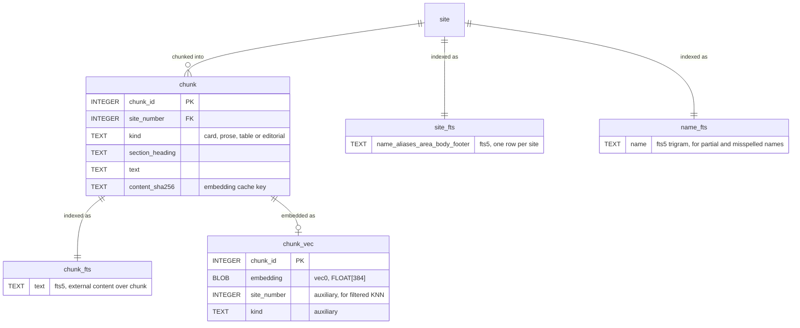

# Matienzo Caves Data

Turns the 5,557 hand-written HTML cave-description pages from
[matienzocaves.org.uk](https://www.matienzocaves.org.uk/descrip/) into a single
queryable SQLite database with full-text and semantic search.

## Layout

| Path | What it is |
| --- | --- |
| `data/pages/` | The scraped corpus, 5,557 pages. Source of truth, committed byte-exactly. |
| `data/vocab/` | Hand-curated canonical area names. Everything else resolves from the text. |
| `data/eval/` | The retrieval eval set: queries with known-correct answers. |
| `data/overrides/` | Per-site corrections applied to parser output. Not present — no site needs one yet. |
| `matienzo/` | The pipeline: decode → parse → normalise → load → chunk → embed → search. |
| `scripts/` | Standalone PEP-723 scripts, run directly rather than imported. |
| `tests/fixtures/` | Frozen copies of the pages the tests assert on. Committed. |
| `docs/design.md` | Corpus reconnaissance, the design it produced, and corrections. |
| `docs/plan-status.md` | What is built, what is not, and how the plan has changed. |
| `matienzo.db` | Derived. Delete it any time; `matienzo build` rebuilds it. |

`data/` is the only source of truth. The database is a disposable
artefact — which is why corrections live in `data/overrides/*.toml` rather than
as database writes, and so survive a rebuild. Create that directory when the
first correction is needed; until then the loader reads it as empty.

## The corpus

`data/pages/` is committed, so a clone has everything needed to reproduce a build.
It is stored with `-text` in `.gitattributes` so git never normalises line
endings: 5,556 of the 5,557 pages use CRLF, every parsed record is keyed by the
SHA-256 of its source bytes, and override staleness is decided by comparing
those hashes. Bytes that change between clones would make that provenance lie.

To re-fetch from the live site:

```bash
uv run scripts/download_htm.py
```

The site is hand-edited and still maintained, so a re-fetch may differ from what
this code was written against. `matienzo audit --diff` reports which pages
changed and re-parses them, rather than letting the drift go unnoticed.

## The schema

`matienzo/db/schema.sql` is the authority and is commented throughout; this is
the shape of it. Every table it defines is `STRICT`, so a type error surfaces at
write time rather than as a baffling comparison months later. Almost everything
hangs off `site`, keyed by the four-digit site number the corpus itself uses,
and cascades from it.

```mermaid
erDiagram
    build         ||--o{ parse_run      : "produced"
    site          ||--o| parse_run      : "was parsed as"
    site          ||..o| source_file    : "came from"
    site          ||--o{ anomaly        : "raised"

    area          ||--o{ area_variant   : "is spelled"
    area          |o--o{ site           : "groups"

    site          ||--o{ site_alias     : "also known as"
    site          ||--o{ coordinate     : "is located at"
    site          ||--o{ quantity       : "measures"
    site          ||--o{ update_date    : "was edited on"

    site          ||--o{ section        : "divided into"
    site          ||--o{ block          : "described by"
    site          ||--o{ body_table     : "tabulates"
    site          ||--o{ bat_observation: "records"
    site          ||--o{ date_mention   : "mentions"
    site          ||--o{ person_mention : "names"
    person        ||--o{ person_mention : "is named by"

    site          ||--o{ xref           : "refers out"
    cave_system   ||--o{ system_member  : "contains"
    site          ||--o{ system_member  : "belongs to"

    site          ||--o{ site_citation  : "cites"
    citation      ||--o{ site_citation  : "is cited by"
    citation      ||--o{ citation_author: "written by"
    author        ||--o{ citation_author: "wrote"

    site          ||--o{ footer_field   : "footer holds"
    site          ||--o{ resource_link  : "links to"
    footer_field  |o--o{ resource_link  : "contains"
    citation      |o--o{ resource_link  : "attaches"
```



| Group | Tables | What it holds |
| --- | --- | --- |
| Provenance | `build`, `source_file`, `parse_run`, `anomaly` | Which parser version produced which row, from bytes of which hash, with what confidence and which anomalies. This is what makes `matienzo audit --diff` able to tell a parser regression from an upstream edit. |
| Sites | `site`, `area`, `area_variant`, `site_alias` | One row per page. The corpus spells the areas many ways for far fewer places, so the variants get their own table and the raw string stays on the site. |
| Measurements | `coordinate`, `quantity`, `update_date` | `quantity.kind` states how a row should be read — a length may be prose rather than a number. Altitude lives on the coordinate, because it belongs to the entrance rather than the site. |
| Description | `section`, `block`, `body_table`, `bat_observation`, `date_mention`, `person`, `person_mention` | The parsed body. `person_mention` is evidence-gated and never populated from bare capitalised bigrams. |
| Graph | `xref`, `cave_system`, `system_member` | Cross-references between sites, and system membership derived from prose lengths such as `included in the Four Valleys System`. |
| Bibliography | `citation`, `author`, `citation_author`, `site_citation` | One row per distinct work. The qualifier is part of `citation_key`, so two logbooks from the same year stay distinct. |
| Links | `footer_field`, `resource_link` | Every link on the page, bucketed by kind and traced back to the footer field or citation it came from. |

Four columns deliberately carry no foreign key: `xref.to_site`,
`site_alias.target_site`, `resource_link.target_site`, and `source_file`'s join
to `site` — which is why the diagram draws that one as a dotted line. Site
numbers are not dense, some being reserved or reallocated, and a reference to a
number with no page is still a real reference, so those columns must be able to
name one. In the current corpus every `xref` target does resolve, but the schema
does not depend on that staying true.

There is one view. `site_summary` joins `site` to `area` and attaches citation
and in/out-reference counts; it is what `matienzo stats` and most ad-hoc `sql`
queries want.

### The search layer

Kept in a separate file, `matienzo/db/search_schema.sql`, because it is rebuilt
independently: re-chunking and re-indexing does not require re-parsing.



Every text index uses `remove_diacritics 2`, which is what makes `riano` find
`Riaño`. There is no porter stemmer: it mangles the Spanish proper nouns that
are most of what anyone searches for. The vectors live in the same file, so
`scp matienzo.db` still moves everything.

## Usage

```bash
uv sync
uv run matienzo decode --audit
```

```bash
uv run matienzo build
uv run matienzo stats
uv run matienzo audit --diff
```

Search it:

```bash
uv run matienzo search "optical brightener"
```

```bash
uv run matienzo search shaft --area vega --min-depth 250
```

```bash
uv run matienzo show 1930
uv run matienzo nearby 105 --radius 300
uv run matienzo graph 107
```

Accents are folded, so `riano` finds `Riaño` and `fernandez` finds
`Fernández`. Add `--passages` to see the matching paragraphs rather than a list
of caves.

## Semantic search

Optional, and local — no API key, no network after the first model download.

```bash
uv sync --extra embed
uv run matienzo embed
```

That takes about five minutes for the 13,280 chunks and is incremental
afterwards: re-running only embeds what changed. Then `--hybrid` fuses keyword
and semantic ranking, which is what makes a query work when you can describe a
cave but not name it:

```bash
uv run matienzo search "hole blocked by a discarded tractor tyre" --hybrid
```

```bash
uv run matienzo evaluate
```

`evaluate` scores keyword, vector and hybrid retrieval against
`data/eval/queries.toml`.

## Using it from Claude Code

```bash
uv sync --extra mcp --extra embed
```

`.mcp.json` registers a `matienzo` server exposing eight tools: site and passage
search, site lookup, geography, the cross-reference graph, citation lookup,
corpus statistics, and a guarded read-only `sql` tool.

Inspect a single page at any stage of the pipeline, or triage the parse:

```bash
uv run matienzo parse 1930
uv run matienzo review
```

## Development

```bash
uv run pytest
```

```bash
uv run ruff check
uv run mypy
```

mypy runs in strict mode over `matienzo/` and `tests/`. `scripts/download_htm.py`
is exempt — it is a standalone PEP-723 script, kept working and left alone apart
from its `requires-python` line.

Lint, formatting hygiene and the type check are wired into pre-commit, and a
GitHub Action runs the same hooks on every push:

```bash
uv run pre-commit install
```

```bash
uv run pre-commit run --all-files
```

The config excludes `pages/`, `tests/fixtures/` and `tests/golden/`. The first
two are byte-exact scraped HTML whose SHA-256 keys every parsed record, so a
whitespace-fixing hook would rewrite the source of truth; the third is
generated. The mypy hook runs through `uv run` rather than in an isolated
pre-commit environment, because strict mode only means anything against the
project's real dependencies.
